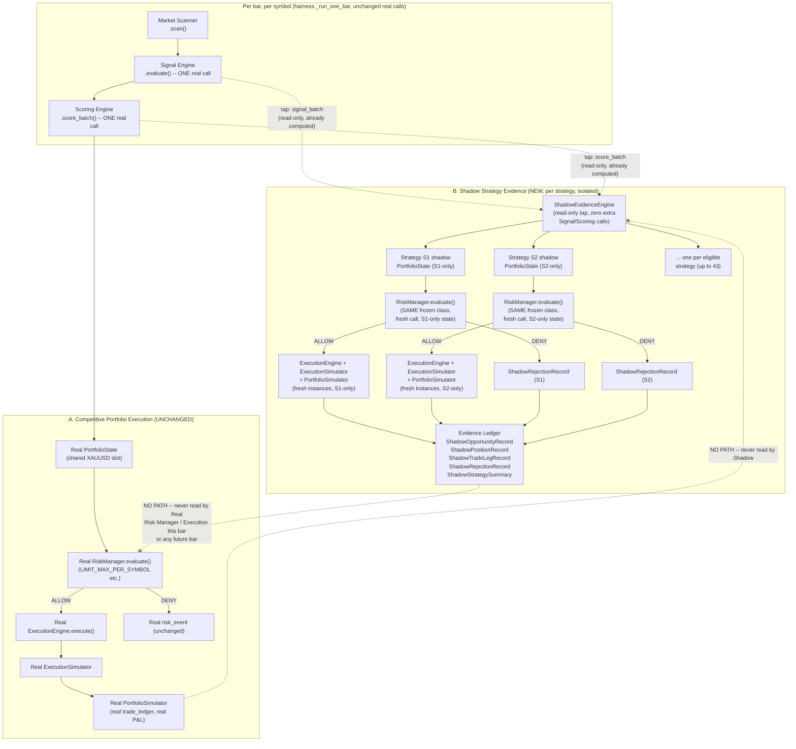

# Phase 6.10 — Shadow Evidence Architecture Design

**Date:** 2026-07-17. **Scope: DESIGN ONLY.** No code is implemented by this document. No strategy,
Scoring Engine, Risk Manager, Execution Engine, Strategy Health methodology, Research Lab, `knowledge/`,
or the sealed holdout is touched, modified, or executed. This document does not select a Strategy Health
integration policy (§9 compares options only). Phase 6.10's official status after this document is
**DESIGN IN PROGRESS** — not implemented, not scoped-and-approved-for-coding.

**Inputs to this design**: `PHASE_6_10_PRE_SCOPE_DIAGNOSTIC.md` (measured evidence: persistent blocking
present in 90.4% of the position gap, same-bar conflict in 45.7%, 39.5% overlap — see its §4.1),
`PHASE_6_9A_STRATEGY_EVIDENCE_FLOW_AUDIT_REPORT.md` (the isolated-slot counterfactual methodology this
design generalizes), and direct source inspection of `ai_trader/simulation/harness.py`,
`portfolio_simulator.py`, `execution_simulator.py`, `risk_manager/engine.py`, `risk_manager/limits.py`,
`time_stop.py`, and `trailing_stop.py` (cited by file/line throughout, not invented).

---

## 1. Problem statement

Phase 6.9A measured that the single-position XAUUSD architecture denies 99.52% of actionable signals
portfolio-wide, and the Phase 6.10 pre-scope diagnostic measured that persistent blocking and same-bar
conflict together explain 96.7% of the resulting evidence gap (§4.1 there). The Strategy Health System
(`ai_trader/strategy_health/`) can only score a strategy from trades it actually completed — with a
median of 7 lifetime trades per strategy over 3.6 years (Phase 6.9's own finding) and an empty ACTIVE
roster at every one of 32 monthly re-evaluation checkpoints (Phase 6.9's own self-reinforcing lockout),
the Health System is starved of evidence not because these strategies are bad, but because the shared
slot never lets most of them trade.

**The problem this design solves**: how to let every eligible strategy accumulate its own, continuous,
independent trading evidence — matching what Phase 6.9A's isolated-slot counterfactual already proved
is measurable and informative — **without introducing a second, ongoing simulation re-run** (Phase
6.9A's isolated counterfactual required 43 full separate multi-year backtests) **and without touching,
risking, or in any way coupling to the real competitive portfolio's actual trades, capital, or risk
profile.**

---

## 2. Scope and non-scope

**In scope (design only):**
- The data contracts, lifecycle, capital model, cost model, concurrency rules, and separation invariants
  for a Shadow Evidence system.
- A comparison of Strategy Health integration options (no selection).
- A test/validation plan and a staged implementation proposal (neither implemented).

**Out of scope / explicitly not done by this document:**
- No code is written or modified. `ai_trader/` is touched only via read-only source inspection, exactly
  as `PHASE_6_10_PRE_SCOPE_DIAGNOSTIC.md`'s own analysis script touched nothing.
- No strategy, its parameters, or its contract changes.
- No Scoring Engine, Risk Manager, or Execution Engine production logic changes — this design reuses
  those modules' own existing, frozen, unmodified code paths (§4).
- No Strategy Health scoring/methodology change, and no integration policy is selected (§9).
- No Research Lab, `knowledge/`, or sealed-holdout access.
- No live/paper trading, Broker Adapter, MT5, or Telegram work — Shadow Mode as designed here is a
  **simulation-only, evidence-collection mechanism**; it does not submit orders to anything real (§7,
  invariant 5).
- No multi-position LIVE trading is introduced for the competitive portfolio — the single-slot
  competitive architecture is explicitly preserved unchanged (§2.A below).

### 2.A — Competitive Portfolio Execution (unchanged)

Everything that exists today: `harness._signal_engine`, `harness._scoring_engine`, `harness._risk_manager`,
`harness._execution_engine`, `harness.execution_simulator`, `harness.portfolio_simulator` — the single
shared XAUUSD slot, `RiskManager`'s `LIMIT_MAX_PER_SYMBOL`/`LIMIT_MAX_POSITIONS` checks
(`risk_manager/limits.py` lines 38–51) evaluated against the REAL `PortfolioState`
(`self.portfolio_simulator.to_portfolio_state(as_of)`, `harness.py` line 333), real order submission via
`self._execution_engine.execute(...)` (`harness.py` line 337), real fills via
`self.execution_simulator.advance_bar(...)` (`harness.py` line 413), and the real trade ledger
(`self.portfolio_simulator.account.trade_ledger`). **Not one line of this changes.**

### 2.B — Shadow Strategy Evidence (new, additive, strictly separate)

A per-strategy, independent virtual position lifecycle that observes the same already-computed signal
and score data every real bar already produces, runs its OWN risk-eligibility check against its OWN
per-strategy-only virtual portfolio state, and — if eligible — opens, manages, and closes a virtual
position using the SAME frozen `ExecutionSimulator`/`PortfolioSimulator`/`time_stop.py`/`trailing_stop.py`
mechanics, but on entirely separate objects with entirely separate internal state. It cannot submit a
real order, cannot appear in the real trade ledger, and cannot alter what the real Risk Manager decides
for the competitive portfolio at any bar, past, present, or future.

---

## 3. Architecture diagram



**Reading the diagram**: the only edges crossing from A into B are read-only taps on `signal_batch`/
`score_batch` — outputs the real pipeline already computed for its own purposes (the exact non-invasive
technique `phase69a_funnel_recorder.py::instrument()` already used and proved behaviorally invisible).
There is no edge from B back into A at any point, in any direction, in this or any future bar — this is
the single load-bearing invariant of the whole design (§7, invariant 1).

---

## 4. Shadow opportunity lifecycle (Objective 1)

| Stage | Mechanism | Reuses (unmodified) | New (shadow-only) |
|---|---|---|---|
| **Setup generation** | Already computed once per bar by the real Signal Engine call (`harness.py` line 329, `self._signal_engine.evaluate(ctx, handles, trader_state=None)`) — Signal Engine evaluates every registered strategy handle's own setup detection, not just the eventual slot-winner. | `SignalEngine.evaluate()`, called once, same as today | A read-only tap on its return value (`signal_batch`), same technique as `FunnelRecorder.record_signal_batch()` |
| **Scoring** | Already computed once per bar by the real Scoring Engine call (`harness.py` line 330). Scoring Engine scores every actionable signal, independent of portfolio state — it has no visibility into the shared slot at all. | `ScoringEngine.score_batch()`, called once, same as today | A read-only tap on `score_batch` |
| **Risk eligibility** | **This is the one stage that must be evaluated AGAIN, per strategy**, because the real call (`harness.py` line 334) evaluates against the REAL, shared `PortfolioState` — precisely the thing Shadow Mode exists to bypass. For each strategy with an actionable, scored signal this bar, call a **dedicated, per-strategy `RiskManager` instance's own** `evaluate()` (never the real instance, never shared across strategies — see §10's corrected characterization: `RiskManager` is NOT stateless, this matters) with `risk_context` unchanged (identical market data this bar) but `portfolio_state` built from **that one strategy's own shadow `PortfolioSimulator` only** (§6). | `RiskManager.evaluate()`/`.configure()` — same frozen class/logic, same `RiskConfig`, one fresh instance per strategy | A fresh, per-strategy `PortfolioState` projection (via each shadow `PortfolioSimulator.to_portfolio_state()`, itself unmodified — `portfolio_simulator.py` line 350, documented "Pure projection... Never mutates `self.account`") |
| **Virtual entry** | If the shadow risk decision is ALLOW, submit it to that strategy's own shadow `ExecutionEngine.execute(decision, shadow_portfolio_state)` (`execution_engine/engine.py` line 118 — a pure function of its two arguments) → that strategy's own shadow `ExecutionSimulator.advance_bar()` fills it exactly as production would. | `ExecutionEngine`, `ExecutionSimulator` — same frozen classes, fresh instances | A `ShadowOpportunityRecord` with `resulting_position_id` set; a new `ShadowPositionRecord` created |
| **Partial exits** | Handled identically to production: `ExecutionSimulator`'s own OCO/bracket fill logic can produce more than one closing fill for one entry (the same mechanism that produces the 65/25 multi-leg positions found in the Phase 6.10 diagnostic, §2 there). Each partial exit is its own `ShadowTradeLegRecord`, all referencing the SAME `position_id` (§5). | `ExecutionSimulator` OCO/bracket logic, unmodified | Explicit `position_id` FK on every leg (§5) — the diagnostic's own reverse-engineering of this relationship becomes unnecessary going forward |
| **Stop-loss / take-profit** | Identical OCO bracket mechanism as production (`execution_simulator.py` lines 464/473) — same cost model, same tick size, same fill logic, per shadow instance. | `ExecutionSimulator` | — |
| **Time-stop** | Identical mechanism (`time_stop.py::build_time_stop_decision`/`positions_due_for_time_stop`, `harness.py` lines 360–378), applied to each shadow `PortfolioSimulator.account.positions` using that same strategy's own `time_stop_bars` (from its `RuntimeEvaluator.api`, unchanged). | `time_stop.py`, unmodified | Called once per shadow instance instead of once for the real portfolio |
| **Trailing-stop / management rules** | Identical mechanism (`trailing_stop.py`, `harness.py` lines 380–411), including the entry-bar-ATR-capture convention (`harness.py` lines 386–394), applied per shadow instance. | `trailing_stop.py`, unmodified | Per-shadow-instance ATR-capture state (§7, invariant 3 — must not read/write the real harness's own `self._trailing_entry_atr`) |
| **Virtual close** | `ExecutionSimulator.advance_bar()` + `PortfolioSimulator.apply(fills, bar_index)`, identical to production, on the shadow instance. Position marked CLOSED in `ShadowPositionRecord`, `full_exit_as_of` set to the last leg's `exit_as_of`. | `PortfolioSimulator`, unmodified | `ShadowPositionRecord.status = CLOSED` |

**Key structural fact this lifecycle depends on**: Signal Engine and Scoring Engine are called **exactly
once per bar, for all strategies together**, regardless of Shadow Mode — no extra calls to either frozen
module are introduced. Only Risk Manager gains extra calls (one per shadow-eligible strategy with an
actionable signal that bar), and only Execution Engine/Simulator/Portfolio Simulator gain extra,
fully-separate instances. This is the single design choice that keeps Shadow Mode computationally
proportional to "how many strategies had a signal today," not "re-run the whole pipeline N times."

**Hard requirement, found necessary during adversarial review (§17, finding H2) and stated here as a
binding constraint on any implementation**: Shadow evaluation may consume ONLY the already-produced,
immutable `signal_batch`/`score_batch` dataclass outputs (`StrategySignal`/`OpportunityScore`) tapped
from the one real Signal/Scoring call this bar. It must **never** re-invoke
`SignalEngine.evaluate_strategy()` or otherwise obtain a live reference to a `RuntimeEvaluator`/handle
object — those objects carry unsynchronized, per-instance mutable cache state
(`RuntimeEvaluator._cache_key`/`_cache_value`, `strategy_runtime/evaluator.py` lines 113–114, 124–130)
and are already processed concurrently by the real Signal Engine's own `ThreadPoolExecutor`
(`signal_engine/engine.py` lines 73, 92, 121). Touching the same evaluator object from a shadow code
path running "concurrently" with the real bar loop is a genuine, unsynchronized data race with no
exception raised — silent corruption of either the real or the shadow signal (or both). This constraint
costs nothing: shadow never needed per-strategy Signal Engine re-evaluation in the first place (§4's own
"Setup generation"/"Scoring" rows above already only call for a read-only tap).

---

## 5. Logical-position identity (Objective 2)

The Phase 6.10 pre-scope diagnostic (§2 there) had to *reverse-engineer* logical positions from
`TradeRecord` rows post-hoc, by grouping on `(strategy_id, entry_as_of)` and hoping no genuine collision
existed (verified true for the existing data, but fragile — a coincidental same-strategy, same-bar
re-entry after a same-bar close would be indistinguishable from a partial-exit leg under that inference).
**Shadow Mode removes this fragility by construction:**

- **`position_id`**: assigned at the moment of virtual entry (recommended: a deterministic string —
  `f"{run_id}:{strategy_id}:{symbol}:{entry_as_of}:{entry_decision_id}"` — reproducible across identical
  replays, per the project's own "determinism law," `SimulationContext`'s own docstring,
  `simulation/config.py` line 126). Not a random UUID, so that two runs of the identical config produce
  identical `position_id`s (needed for the deterministic-replay test, §10).
- **`strategy_id` behavior**: exactly one shadow account per strategy; `strategy_id` is a foreign key on
  every record type (§6), never inferred.
- **Partial-exit attribution**: every `ShadowTradeLegRecord` produced by the SAME entry order (whether
  from an OCO bracket's own multi-fill behavior, a scaled take-profit, or any future partial-exit
  mechanism) carries the SAME `position_id`, assigned once at entry and never recomputed. Aggregation
  fields on `ShadowPositionRecord` (`n_legs`, `aggregate_net_pnl`, `full_exit_as_of` = MAX leg
  `exit_as_of`) are maintained incrementally as legs close, not inferred after the fact.

This directly satisfies the CEO's Objective 2 and eliminates the exact ambiguity the diagnostic had to
disclose and work around in its own §2.

---

## 6. Capital and risk model (Objective 3)

**Recommendation: fixed nominal capital per shadow strategy, identical across all strategies, decoupled
from the real portfolio's own equity.** Concretely: each shadow strategy's own `PortfolioSimulator` is
constructed from its own `SimulationContext` with `starting_balance` and `cost_model`/`risk_config`
identical to the convention Phase 6.9A's own isolated-run counterfactual already used ($2,000,
`risk_per_trade_pct=0.05`, same spread/liquidity floor overrides — `phase69a_funnel_run.py`'s own
`_risk_config()`), **not** a slice of the real portfolio's live equity curve.

**Options considered and the reasoning for rejecting the other two:**

| Option | Verdict | Why |
|---|---|---|
| **Fixed nominal capital (recommended)** | ✅ | Every shadow strategy is judged against the identical, constant baseline Phase 6.9A already established as this project's own comparability convention. Matches the isolated-slot counterfactual exactly (validation §10, item 2). |
| Fixed-R (risk a constant $ amount per trade, no account/equity tracking at all) | ❌ rejected | Would prevent computing real equity-curve statistics (drawdown, Sharpe-like ratios) per shadow strategy, which `ShadowStrategySummary` (§7) needs for eventual Health-System comparability; loses information for no benefit over fixed nominal capital. |
| Cloned real portfolio equity (shadow accounts start from and track the REAL account's own current equity) | ❌ rejected | Two problems: (1) **contamination risk** — even a read-only "clone" of live equity creates a live data dependency from B into A's own state, the opposite of the required strict separation (§7); (2) **comparability problem** — two shadow strategies evaluated during a real drawdown vs. a real rally would be sized differently through no fault of their own, confounding cross-strategy comparison with the REAL portfolio's own specific historical P&L sequence. |

**Preventing distortion from concurrent virtual positions**: because each strategy has its OWN dedicated
shadow account (not a shared shadow pool), one strategy's shadow trade can never affect another
strategy's shadow capital, margin, or risk-eligibility. Within a single strategy's own shadow account,
the SAME frozen `RiskConfig`/`limits.py` checks (`LIMIT_MAX_POSITIONS`, `LIMIT_MAX_PER_SYMBOL`) apply
identically to production — by default this means **a single strategy cannot hold two concurrent shadow
positions on XAUUSD at once**, exactly mirroring Phase 6.9A's own isolated-run behavior (verified:
`phase69a_isolated_funnel.json`'s own per-strategy trade ledgers never show overlapping intervals for the
same strategy).

**Comparing strategies fairly**: identical starting capital + identical risk-per-trade-pct + identical
cost model across all shadow accounts is what makes `ShadowStrategySummary`'s per-strategy statistics
(win rate, expectancy, R-multiple distribution) directly comparable to each other, exactly as Phase 6.9A's
own all-43-isolated-runs comparison already relied on.

---

## 7. Cost and execution parity (Objective 4)

**Requirement: exact parity with the isolated-slot simulation methodology, not an approximation of it.**

| Concern | Design answer |
|---|---|
| **Spread** | Identical `RiskConfig.filters.reference_spread["XAUUSD"]` and `context.cost_model` as the real/isolated convention — same `RiskConfig` object (or a value-identical copy) passed to every shadow `RiskManager`. |
| **Commission** | Identical `CostModel` (`simulation/config.py`) shared by reference (it is immutable configuration, not mutable state) across real and every shadow `SimulationContext`. |
| **Slippage** | Identical `max_slippage_pct` / `Constraints.max_slippage` formula (`time_stop.py` line 80's own convention, reused unmodified) applied inside each shadow `ExecutionSimulator`. |
| **Entry timing** | Identical fill-timing convention, because it is literally the SAME `ExecutionSimulator` class, not a re-implementation — whatever next-bar/same-bar fill rule production uses today applies unchanged to shadow fills. |
| **Bar-order ambiguity** | Within one bar, shadow strategies' own risk/execution evaluations have NO shared resource to contend over (§8 — each has its own account), so cross-strategy evaluation order does not affect any shadow strategy's own result. It DOES need a fixed, deterministic order for reproducibility (recommended: same `sorted(...)` convention the harness already applies to symbols, extended to strategy iteration — e.g. sorted by `strategy_id`) so that deterministic-replay (§10) is exactly reproducible, not just statistically so. |
| **Exact parity with isolated-slot simulations** | **CORRECTED (Checkpoint 1C, 2026-07-18 — see §19): this cell's original claim was wrong and is struck below, not merely refined.** The struck claim asserted the computation was "mathematically the same" as a from-scratch isolated rerun, attributing any divergence solely to cooldown/mid-window-start timing. Checkpoint 1C's own empirical validation (§19) found this false: shadow risk evaluation DOES reuse `RiskManager.evaluate()` unmodified against a portfolio_state scoped to one strategy (true, and this part of the parity claim holds), but the `score_batch` feeding that evaluation is the COMPETITIVE run's own already conflict-adjusted batch (§4's own "Setup generation"/"Scoring" rows — an explicit, deliberate design choice, not an oversight), never a from-scratch single-strategy re-score the way `phase69a_isolated_run.py::run_isolated(strategy_id)` (via `strategy_id_filter`) produces. This is a second, independent, and empirically LARGER divergence source than cooldown timing — see §19 for the validated semantics and the corrected acceptance language. ~~because shadow risk evaluation reuses `RiskManager.evaluate()` unmodified with a portfolio_state scoped to exactly one strategy, and shadow execution reuses `ExecutionSimulator`/`PortfolioSimulator` unmodified in a fresh, single-strategy instance, the computation performed is mathematically the same one `phase69a_isolated_run.py::run_isolated(strategy_id)` already performed offline — just computed inline, concurrently with the real competitive run, in one pass instead of 43 separate full-window backtests. The one known source of divergence (disclosed, not hidden): `PHASE_6_10_PRE_SCOPE_DIAGNOSTIC.md` §8 item 3 found a 43%-of-competitive-positions residual where cooldown-after-loss state differs between an isolated run and the competitive run — an analogous divergence could in principle appear between a shadow account's own cooldown state and a TRUE from-scratch isolated rerun's cooldown state IF the shadow account's own start time differs from a fresh isolated run's start time (e.g., Shadow Mode enabled mid-window vs. Phase 6.9A's isolated runs which always started at the window's own beginning). This is a testable, not merely theoretical, concern — flagged explicitly in §10's validation plan and §11's limitations, not asserted away.~~ |

---

## 8. Concurrent shadow positions (Objective 5)

- **One strategy, more than one virtual position at once**: **no, by default** — the shadow account
  reuses the SAME `RiskConfig.portfolio_limits` (`LIMIT_MAX_POSITIONS`, `LIMIT_MAX_PER_SYMBOL`) as
  production, applied to that strategy's own 1-strategy shadow portfolio, which structurally limits it to
  one open XAUUSD position at a time — matching the isolated-slot precedent exactly. (Flagged as an
  **open decision**, §12: whether a future Phase 6.10 iteration might deliberately relax this for
  specific research purposes — not recommended now, since it would break exact isolated-slot parity.)
- **Different strategies, simultaneously**: **yes, this is the entire point.** Each strategy's shadow
  account is fully independent; there is no shared shadow slot across strategies. S39 and S46 (the top
  two blockers identified in the pre-scope diagnostic, §4 there) can both hold open shadow positions at
  the same time without contending with each other, exactly reproducing what their own isolated runs
  already showed was possible.
- **Same-strategy overlap**: cannot occur under the default design (see above) — the shadow Risk Manager
  call would DENY a second entry attempt for a strategy that already holds an open shadow position, via
  the same `LIMIT_MAX_PER_SYMBOL` check reused unmodified.
- **Opposing directions across strategies**: **represented independently, with no netting.** If S39's
  shadow account is LONG XAUUSD while S46's shadow account is SHORT XAUUSD at the same bar, both are
  recorded as-is in their own separate `ShadowPositionRecord`s — there is no shadow-level portfolio
  netting or hedging logic, exactly mirroring how Phase 6.9A's own isolated counterfactual treated every
  strategy as if it were the only one trading. (This is explicitly NOT a simulation of "what if all 43
  strategies traded on one combined multi-slot account" — that is Phase 6.10 prep-doc option **I**
  /this design's own menu option **B**, explicitly not being designed here.)

---

## 9. Evidence ledger — data contracts (Objective 6)

All five record types below are the **minimum required fields**; an implementation phase may add
non-load-bearing bookkeeping fields, but must not omit any of these.

**Revised during adversarial review (§17, finding on data-contract reuse)**: the first draft of this
section defined all five types as if freshly invented. Direct inspection of the repository's own
existing types found meaningful, unnecessary duplication against `TradeRecord`
(`simulation/portfolio_simulator.py` lines 50–69), `RiskEventRecord` (`simulation/types.py` lines
233–251), and — most importantly — `strategy_health/types.py`'s own `ClosedTrade`/`WindowMetrics`
(lines 14–26, 47–67). The schema below is revised to REUSE those shapes additively wherever a genuine
match exists, per the CEO's own explicit preference for additive extension over parallel incompatible
schemas, and per this project's own established precedent (Phase 6.9A's `RiskEventRecord.strategy_id`
addition was exactly this pattern).

```
ShadowOpportunityRecord
  # A denormalized, persisted snapshot of one bar's already-computed StrategySignal + OpportunityScore
  # (both frozen, existing types) plus the one genuinely new field this stage needs (the shadow-only
  # risk decision). Not a duplicate of those types -- it is their read-only union at one point in time,
  # persisted because the live signal_batch/score_batch objects are not themselves retained bar to bar.
  opportunity_id: str          # deterministic, e.g. f"{run_id}:{strategy_id}:{symbol}:{as_of}"
  strategy_id: str
  symbol: str
  as_of: int                   # bar timestamp
  direction: Direction         # LONG/SHORT, from the real signal_batch tap (StrategySignal's own field)
  signal_state: str            # BUY/SELL, from StrategySignal.state (only actionable signals produce a record)
  score_recommendation: str    # from OpportunityScore.recommendation (STRONG/MODERATE/WEAK_OPPORTUNITY/etc.)
  shadow_risk_decision: str    # ALLOW / DENY -- THIS is the one new field; nothing upstream has it
  shadow_denied_reason: str | None
  resulting_position_id: str | None   # set iff shadow_risk_decision == ALLOW; NEVER re-set on partial exit (§5)

ShadowPositionRecord
  # Confirmed genuinely new during adversarial review: no existing type in the repository represents a
  # logical position spanning partial-exit legs -- this is precisely the gap
  # `PHASE_6_10_PRE_SCOPE_DIAGNOSTIC.md` §2 had to reverse-engineer post-hoc. Legitimate new type.
  position_id: str             # assigned once, at virtual entry (§5)
  strategy_id: str
  symbol: str
  direction: Direction
  entry_as_of: int
  entry_price: float
  entry_opportunity_id: str    # FK -> ShadowOpportunityRecord
  status: str                  # OPEN | CLOSED
  full_exit_as_of: int | None  # MAX(leg.exit_as_of), None while OPEN
  n_legs: int
  aggregate_net_pnl: float | None      # sum of legs' net_pnl, None while OPEN
  aggregate_holding_bars_full: int | None   # bars from entry_as_of to full_exit_as_of

ShadowTradeLegRecord
  # REVISED: this is `TradeRecord` (simulation/portfolio_simulator.py lines 54-69) VERBATIM --
  # client_order_id, strategy_id, symbol, direction, entry_price, exit_price, entry_as_of, exit_as_of,
  # qty, gross_pnl, fees, net_pnl, pnl_r, holding_bars, mfe, mae -- PLUS exactly 2 additive fields.
  # Not a parallel incompatible schema: an implementation should define this as TradeRecord extended
  # with position_id and exit_reason (dataclass composition/inheritance, implementation's own choice),
  # not 16 fields re-declared from scratch.
  # client_order_id, strategy_id, symbol, direction, entry_price, exit_price, entry_as_of, exit_as_of,
  # qty, gross_pnl, fees, net_pnl, pnl_r, holding_bars, mfe, mae   <- identical to TradeRecord, verbatim
  position_id: str              # NEW: FK -> ShadowPositionRecord (§5 -- never inferred)
  exit_reason: str              # NEW: EXPLICIT enum: STOP_LOSS | TAKE_PROFIT | TIME_STOP | TRAILING_STOP |
                                 # FORCED_CLOSE_AT_WINDOW_END -- set directly by the mechanism that
                                 # closed it, NOT inferred from a client_order_id string (a design
                                 # improvement over the diagnostic's own necessary workaround, §2's
                                 # exit_reason() heuristic in phase610_prescope_analysis.py)

ShadowRejectionRecord
  # REVISED: modeled on RiskEventRecord's own existing, CEO-approved additive pattern
  # (simulation/types.py lines 233-251: type, as_of, detail, strategy_id -- the Phase 6.9A precedent for
  # adding strategy_id to an existing internal event type rather than inventing a new one). NOT a
  # literal reuse of RiskEventRecord itself, because that type is explicitly documented as internal-only,
  # aggregated "by type only" (never by symbol/direction) and never serialized -- shadow rejections need
  # symbol/direction granularity RiskEventRecord was never meant to carry. Shape kept deliberately close
  # to the existing pattern rather than diverging further than necessary.
  rejection_id: str
  strategy_id: str
  symbol: str
  as_of: int
  direction: Direction
  denied_reason_code: str        # e.g. FILTER_SPREAD, FILTER_LIQUIDITY, COOLDOWN_AFTER_LOSS, etc. --
                                  # NEVER LIMIT_MAX_PER_SYMBOL/LIMIT_MAX_POSITIONS against the REAL
                                  # portfolio (shadow doesn't see it) -- only genuine, strategy-own-
                                  # account-scoped denials are possible here by construction, PLUS the
                                  # new SHADOW_INTERNAL_ERROR reason code from §10.1's failure isolation
  denied_detail: str | None

ShadowStrategySummary
  # MAJOR REVISION (adversarial review finding): the first draft reinvented a bespoke, less complete
  # metrics schema (win_rate/expectancy_r only) when `strategy_health/types.py::WindowMetrics` (lines
  # 47-67) ALREADY defines a far more complete, FROZEN, already-scoring-compatible shape (win_rate,
  # profit_factor, expectancy_currency, expectancy_r, net_r, net_pnl, max_drawdown,
  # monthly_consistency, equity_stability, max_losing_streak, avg_holding_bars) computed by
  # `strategy_health/metrics.py`'s own frozen functions from a stream of `ClosedTrade`-shaped records
  # (strategy_id, exit_as_of, net_pnl, pnl_r, holding_bars -- types.py lines 14-26).
  #
  # ShadowTradeLegRecord (above) is trivially projectable into `ClosedTrade`'s exact shape (it is a
  # strict superset of ClosedTrade's 5 fields). This means shadow evidence can be run through
  # `strategy_health/metrics.py`'s OWN FROZEN, UNMODIFIED computation functions -- exactly like Real
  # evidence already is -- producing a genuine `WindowMetrics` object, just from a shadow-sourced
  # `ClosedTrade` stream instead of a competitive-sourced one. This means NO new scoring math needs to
  # be written for §11's option 3 ("separately labeled competitive and shadow evidence") whenever it is
  # eventually approved -- only a new, labeled INPUT STREAM into code that already exists.
  #
  # ShadowStrategySummary is therefore redefined as a thin wrapper, not a parallel metrics schema:
  strategy_id: str
  source: str                    # "shadow" -- the ONE label distinguishing this from a competitive-
                                  # sourced WindowMetrics; makes §11 option 3 trivial, never silently merged
  window_metrics: object          # a genuine strategy_health.types.WindowMetrics, computed by the
                                  # SAME frozen metrics.py functions, fed this strategy's own shadow
                                  # ClosedTrade stream -- not reinvented
  n_opportunities: int            # shadow-specific bookkeeping WindowMetrics doesn't already carry
  n_shadow_denied_by_reason: dict[str, int]   # shadow-specific bookkeeping WindowMetrics doesn't already carry
```

---

## 10. Separation guarantees — invariants (Objective 7)

Each invariant below states what must be TRUE and, where possible, how it would be tested (§13).

1. **Shadow Mode cannot alter competitive trade selection.** The real Risk Manager call at `harness.py`
   line 334 is passed `self.portfolio_simulator.to_portfolio_state(as_of)` — the REAL account's own
   projection. No shadow object is ever substituted for it, read by it, or merged into it. *Test*: a
   byte-identical parity run (§13, test 1).
2. **Shadow Mode cannot alter portfolio P&L.** `self.portfolio_simulator.account` (the real ledger) is
   never written to by any shadow code path — shadow fills apply only to shadow `PortfolioSimulator`
   instances, objects the real harness never holds a reference to being written from shadow logic.
3. **Shadow Mode cannot alter portfolio risk.** The real `RiskContext` object passed to the real
   `RiskManager.evaluate()` call is never mutated by shadow code. **Corrected during adversarial review
   (§17, finding H1)**: `RiskConfig` (`risk_manager/config.py` line 131) is `@dataclass(slots=True)` —
   **not** `frozen=True` — and its own docstring calls it "immutable-by-convention" only; it also carries
   genuinely mutable dict fields (`correlation_groups`, `CooldownLimits.per_strategy_cooldown_bars`,
   `PreTradeFilterLimits.reference_spread`/`liquidity_floor`, `SizingLimits.point_value`). No production
   code path mutates these in place today (confirmed by direct inspection; only test fixtures do), but
   sharing ONE `RiskConfig` instance by reference across the real `RiskManager` and up to 43 shadow
   `RiskManager`s (44 total references instead of today's 1) removes what little safety margin existed.
   This invariant is therefore only as strong as "no future code mutates a shared config's dict fields in
   place" — a convention, not an enforced guarantee. *Required test*: an explicit assertion (or a deep
   equality snapshot taken before/after a shadow-enabled run) that the shared `RiskConfig` object is
   byte-identical at the end of a run to what it was at the start.
4. **Shadow Mode cannot alter order execution.** Shadow ALLOW decisions are submitted only to a
   shadow-owned `ExecutionEngine`/`ExecutionSimulator` pair — never `self._execution_engine`/
   `self.execution_simulator` (the harness's own real objects, referenced only by the real code path).
   **Strengthened during adversarial review (§17, finding H3), now a hard requirement, not a
   recommendation**: `ExecutionEngine` is a single stateful instance bound to one adapter with its own
   internal `OrderLedger` (`execution_engine/ledger.py`), and `client_order_id`s are derived
   deterministically as `f"{strategy_id}|{symbol}|{as_of}"` (`risk_manager/assembler.py` lines 33, 102;
   `execution_engine/builder.py` lines 152–153) with **no real/shadow discriminator**. If a shadow
   `ExecutionEngine`/`ExecutionSimulator` were ever accidentally the SAME instance as the real one (or
   shared between two shadow strategies), `ExecutionSimulator.submit_order()`'s own duplicate guard
   (`execution_simulator.py` lines 112–116: `if order.client_order_id in self._orders: return
   BrokerAck(accepted=True, ...)`) would **silently no-op the second submission — no exception, no log
   entry distinguishing it from a normal fill**. Defense in depth, required: every shadow-generated
   `decision_id`/`client_order_id` must carry an explicit `"SHADOW-"` prefix (or equivalent) that can
   never collide with a real id, so that even a wiring bug cannot silently merge a real and a shadow
   order under one id — the primary defense (fully separate instances) should never fail, but the
   consequence of it failing is silent, which justifies a second, independent, cheap safeguard.
5. **Shadow Mode cannot alter strategy outputs.** Signal Engine and Scoring Engine are called EXACTLY
   ONCE per bar (§4) — Shadow Mode only taps their already-computed return values; it never triggers a
   second Signal/Scoring evaluation that could differ from or overwrite the real one. **See the hard
   requirement added to §4** (adversarial review finding H2): shadow may never obtain a live reference to
   a `RuntimeEvaluator`/handle object, only the immutable tapped output.
6. **Shadow Mode cannot access or contaminate the sealed holdout.** Shadow Mode's own window is
   controlled by the SAME `SimulationContext.date_range` mechanism as everything else in this project —
   it does not, by itself, request, open, or reference the sealed holdout window
   (2025-10-23 09:15 UTC → 2026-07-13 06:00 UTC). Enabling Shadow Mode on an already-approved,
   already-non-holdout window changes nothing about which window is used.
7. **No real order is ever submitted by Shadow Mode.** Shadow `ExecutionEngine`/`ExecutionSimulator`
   instances are pure in-process simulation objects with no connection to any broker adapter — there is
   no live/paper trading path for this design to accidentally use, since none exists yet in this project
   at all.
8. **Shadow Mode cannot alter Strategy Health classifications.** `ShadowStrategySummary` (§9, revised) is
   a distinct evidence stream, never written into any input `strategy_health/` reads today. No code path
   in this design writes to `strategy_health/evaluator.py`'s own inputs or outputs, and §11's integration
   options remain entirely unselected and unimplemented.
9. **A failing shadow strategy cannot alter or terminate competitive execution.** See the new §10.1
   (Failure isolation), added during adversarial review (§17) — the original design had no explicit
   answer to this and it is a required addition, not an optional one.

**The single most important test, restated**: run the identical `SimulationContext`/config twice — once
with Shadow Mode enabled, once without — and assert the REAL trade ledger and the REAL, full
`SimulationReportData` (portfolio summary, performance, attribution, stats, allocation, risk events —
every field, per the exact standard Phase 6.9A's own `_full_report_dict()` established after its own
adversarial review caught a narrower check, §1.1/§4.1 of that report) are **byte-identical**. This is the
same technique, and the same completeness bar, Phase 6.9A already proved for its own instrumentation —
Shadow Mode must clear an equal or higher bar, since it does far more than count.

### 10.1 Failure isolation (added during adversarial review, §17 — this document originally had no answer)

**Requirement**: a shadow strategy's own risk/execution processing must be wrapped in its own
per-strategy, per-bar failure boundary. If a shadow strategy's own `RiskManager.evaluate()`,
`ExecutionEngine.execute()`, or `PortfolioSimulator` call raises an exception or produces invalid/
inconsistent internal state:

1. The exception is caught **at the per-strategy tap point**, never allowed to propagate into
   `_run_one_bar()`'s own real-path control flow.
2. The failure is recorded (a new reason code on `ShadowRejectionRecord`, e.g.
   `SHADOW_INTERNAL_ERROR`, carrying whatever detail is safely available — never fabricated) — this
   keeps the failure visible and auditable rather than silently swallowed.
3. That ONE strategy's shadow tracking is marked degraded for the remainder of the run (or just that
   bar, configurable at implementation time) — every OTHER shadow strategy, and the real competitive
   path, continue completely unaffected.
4. The real competitive backtest **never halts, retries, or alters its own behavior** because a shadow
   strategy failed — this is a hard requirement, not a configurable default, **unless** a run is
   explicitly configured for diagnostic testing with a "fail loud" flag (e.g. a unit test specifically
   verifying failure-isolation behavior itself, which WANTS the exception to surface so the test can
   assert it was caught correctly) — the CEO's own instruction on this point (`"unless explicitly
   configured for diagnostic testing"`) is honored literally: production/normal runs always isolate,
   test runs may opt into observing the failure directly.

This directly closes a genuine gap: the original design document did not specify failure handling at
all. It is a required addition, not merely a documented afterthought — Checkpoint 1 (§14) cannot be
considered complete without this boundary in place, since a single buggy or edge-case-triggering
strategy evaluator must never be able to take down (or silently corrupt) the real competitive run it
sits alongside.

---

## 11. Strategy Health integration — options compared, none selected (Objective 8)

**This document does not select an integration policy.** Three options, compared:

| Option | Description | Pros | Cons | Requires |
|---|---|---|---|---|
| **1. Health uses competitive evidence only** (status quo) | No change — `strategy_health/evaluator.py` continues reading only real `trade_ledger` entries. | Zero risk of shadow-evidence quality issues (correlation, selection bias, §12) reaching a live-affecting score. Simplest, most conservative. | Does not solve the problem this phase exists to address — the self-reinforcing lockout (Phase 6.9) persists unchanged. | Nothing — already true today. |
| **2. Health uses shadow evidence only** | Health scoring switches its input source to `ShadowStrategySummary` exclusively. | Directly solves the evidence-sparsity problem — every strategy gets continuous evidence regardless of the shared slot. | Shadow evidence is not equivalent to live-fill evidence (§12) — a strategy could be scored ACTIVE from shadow trades it would never have gotten in the real, capital-constrained world, or vice versa. Loses the real-world grounding Health scoring currently has entirely. | A full re-derivation of Strategy Health's own scoring inputs — the CEO's own standing rule (`PROJECT_STATE_v2.md` §8) is that `strategy_health/`'s scoring methodology is frozen; this option would need its own dedicated approval to even begin, separate from this design document. |
| **3. Health uses separately labeled competitive and shadow evidence** | Health scoring (or a new, adjacent view) consumes BOTH `trade_ledger`-derived and `ShadowStrategySummary`-derived evidence, explicitly tagged by source, never silently merged. | Preserves the real-evidence grounding of option 1 while surfacing shadow evidence as an additional, clearly-labeled signal (e.g. "this strategy has 2 real ACTIVE-qualifying trades AND 47 shadow trades with a 61% shadow win rate") — a human (or a later-designed scoring rule) can weigh them differently rather than the system silently conflating them. | More complex: requires a defined policy for how the two evidence types combine (or explicitly do NOT combine) for classification purposes — that policy is exactly what a dedicated Health-integration design phase would need to specify, and is deliberately NOT specified here. | A dedicated, separate design (and CEO approval) for exactly how "separately labeled" evidence feeds classification — this document's own `ShadowStrategySummary` (§9) is deliberately shaped to make this option implementable later, but implementing the actual integration policy is out of scope here. |

**No recommendation is offered between these three in this document** — the CEO's instruction is
explicit that Health integration is not selected in this phase. The only design commitment made now is
structural: `ShadowStrategySummary` is a distinct type from whatever `strategy_health/` consumes today,
which keeps all three options open rather than foreclosing any of them.

---

## 12. Known limitations (Objective 11)

1. **Correlated strategies**: the pre-scope diagnostic's own §3/§6 found S39↔S40 co-occurring in 61 of
   their own same-bar conflicts (essentially the entirety of either strategy's own conflict
   participation). Shadow Mode will faithfully record BOTH strategies' own hypothetical trades — it does
   not detect or correct for the fact that two highly correlated strategies' shadow evidence may be
   substantially the same underlying market event counted twice. This is a data-generation design, not a
   deduplication one; deduplication (if ever wanted) would be a downstream analysis question, not a
   Shadow Mode responsibility.
2. **Duplicated market hypotheses**: more broadly than pairwise correlation, several strategies may
   encode near-identical trading logic under different parameterizations. Shadow Mode treats every
   registered strategy as an independent evidence source by design (§6) — it cannot and does not attempt
   to detect conceptual duplication.
3. **Economically distinct versus statistically independent evidence**: the pre-scope diagnostic's own
   §7 found ~74% of isolated positions remain economically distinct even after strict same-bar
   deduplication — but "economically distinct" (not the same market event) is not the same claim as
   "statistically independent" (uncorrelated performance). Two economically distinct shadow trades from
   two different strategies can still be highly correlated in their outcomes if both strategies key off
   the same underlying volatility regime, trend, or macro driver. Shadow Mode's evidence should not be
   treated as N independent samples for statistical purposes without further analysis.
4. **Simultaneous exposure**: because shadow accounts are fully independent per strategy (§8), the SUM of
   all 43 strategies' own shadow "risk" at any moment is not bounded the way the real portfolio's shared
   slot bounds real risk — this is intentional (it is what makes evidence collection possible at all),
   but it means shadow-derived statistics must never be read as "what the portfolio's risk would have
   been" if all shadow trades had been real simultaneously; no such aggregate claim is licensed by this
   design.
5. **Selection bias**: the shadow-eligible strategy universe (which strategies get a shadow account at
   all, and from what start date) is itself a design choice not fully resolved here (§14, open
   decisions). If shadow tracking begins only after a strategy's own Health status has already
   deteriorated, or only for a hand-picked subset, the resulting evidence base would inherit whatever
   selection logic chose that starting point — not a neutral, from-inception sample.
6. **Shadow evidence is not equivalent to live fill evidence**: even with exact cost/execution parity
   (§7), a shadow fill assumes the same liquidity, spread, and price impact would have been available had
   the order been real — an assumption already disclosed as a limitation of the isolated-slot
   counterfactual itself (Phase 6.9A's own report, and `PHASE_6_10_PREPARATION.md` §2's explicit "the
   evidence does NOT show these strategies would be profitable if given independent slots"). Shadow Mode
   generalizes and continuously operationalizes that same counterfactual — it inherits its
   interpretive caveat exactly, not less of one.

---

## 13. Test / validation plan (Objective 9)

| # | Test | Proves | Method |
|---|---|---|---|
| 1 | **Shadow-disabled parity** | Enabling the Shadow Mode CODE PATH with zero shadow-eligible strategies configured produces byte-identical results to today's baseline | Same technique as Phase 6.9A's `verify_zero_behavior_change()` — full `SimulationReportData` + trade ledger equality, not a subset |
| 2 | **Shadow-enabled, zero effect on competitive execution** | The REAL trade ledger and REAL full report are byte-identical whether Shadow Mode is enabled (with strategies actively shadow-tracked) or disabled, for the identical config | Run the identical `SimulationContext` twice, diff the real `trade_ledger`/`SimulationReportData` only — this is the single most important test (§10) |
| 3 | **Isolated-slot reproduction** | Each shadow strategy's own ledger, over the identical window/config already used by Phase 6.9A, matches `phase69a_isolated_funnel.json`'s own per-strategy trade ledger (entry/exit price, `entry_as_of`, direction, `holding_bars`, `pnl_r`) | Direct comparison against the already-committed, preserved JSON artifact — no new "ground truth" run needed for this specific check |
| 4 | **Logical-position counts are correct** | `position_id` assignment and `n_legs`/`full_exit_as_of` aggregation behave correctly, INCLUDING for a hand-constructed multi-leg (partial-exit) scenario | A small, deliberately-constructed fixture (not real market data) exercising a known 2-leg scaled exit, asserting exactly 1 `ShadowPositionRecord` and 2 `ShadowTradeLegRecord`s sharing its `position_id` |
| 5 | **Partial exits do not inflate opportunity counts** | A position that produces 2 trade-legs still counts as exactly 1 `ShadowOpportunityRecord`/1 virtual entry | Assert `ShadowOpportunityRecord` count == number of DISTINCT virtual entries, independent of `ShadowTradeLegRecord` count — directly targeting the same miscount this design's own predecessor document (`PHASE_6_10_PRE_SCOPE_DIAGNOSTIC.md` §2) had to find and fix by hand |
| 6 | **Deterministic replay** | Running the identical Shadow-enabled config twice produces a byte-identical shadow ledger (all 5 record types) | Two full runs, diff every ledger table; relies on `position_id`'s own deterministic construction (§5) and the fixed strategy-iteration order (§7) |
| 7 | **Zero effect on competitive execution** (explicit test class) | Restates test 2 as its own named test suite (`TestShadowDoesNotAffectCompetitiveExecution`) for visibility in CI/test reports, per this project's own convention of naming the property being protected, not just the mechanism | Same method as test 2 |
| 8 | **Bounded memory and runtime overhead** | Shadow Mode's wall-clock and peak-memory cost, relative to a shadow-disabled run of the identical window, stays within a budget agreed at implementation time (not invented as a number here without a benchmark) | Benchmark shadow-enabled vs. disabled over the full window at increasing shadow-eligible strategy counts (1, 10, 43) to characterize scaling before committing to "all 43 always on" |

**Additional test implied by §7's own disclosed open concern**: a test specifically checking whether a
shadow account's own cooldown-after-loss state, when Shadow Mode is enabled MID-WINDOW (not from the
window's own start), diverges from what a from-scratch isolated rerun starting at the window's own
beginning would show — quantifying, not assuming away, the caveat raised in §7's cost/execution-parity
discussion.

---

## 14. Staged implementation proposal (Objective 10) — **not implemented**

| Checkpoint | Content | Exit criterion (not executed by this document) |
|---|---|---|
| **0. Contracts only** | The 5 record types (§9) as frozen dataclasses; no behavior. A parity-test scaffold reusing Phase 6.9A's own `verify_zero_behavior_change()` pattern, run against TODAY's harness with no shadow code yet, to lock in the "shadow-disabled == baseline" starting point. | Test 1 (§13) passes trivially (no shadow code exists yet — this checkpoint only proves the scaffold itself is correct). |
| **1. Single-strategy risk-eligibility tap** | Wire the `ShadowEvidenceEngine` tap (§4) for exactly ONE strategy (recommended: S10, the pre-scope diagnostic's own most slot-starved victim, §4 there) — `ShadowOpportunityRecord`/`ShadowRejectionRecord` generation only, no virtual entry/execution yet. | S10's own shadow-DENY reason distribution matches its own known funnel counts (`phase69a_analysis.json`'s own S10 row) for the genuine (non-slot) denial reasons; slot-specific denials should not appear at all (shadow bypasses the shared slot by construction). |
| **2. Single-strategy full lifecycle** | Add virtual entry + the full position/trade-leg lifecycle (§4) for that same one strategy, via a dedicated shadow `ExecutionEngine`/`ExecutionSimulator`/`PortfolioSimulator` instance. | **CORRECTED (Checkpoint 1C, 2026-07-18 — see §19): the exit criterion below assumed near-exact reproduction; the CEO's own ruling establishes this was never the correct bar.** Completed and CEO-accepted with a documented semantic limitation: the shadow ledger reproduces the FIRST 2 of `phase69a_isolated_funnel.json["S10"]`'s 117 trades exactly, then diverges (68 shadow trades total) — root cause verified as competitive-context conflict-adjusted score reuse (§7, §19), not primarily cooldown/mid-window timing. ~~Test 3 (§13) passes for S10 specifically: the shadow ledger reproduces `phase69a_isolated_funnel.json["S10"]`'s own trades exactly (or the observed divergence is fully attributable to the cooldown/mid-window-start caveat already disclosed, §7/§13's additional test).~~ |
| **3. Scale to all 43** | Extend to every shadow-eligible strategy running concurrently in one pass. | Tests 1, 2, 4, 5, 6 (§13) pass across the full roster; test 8's benchmark is run and its result documented (not pre-judged) before any wider rollout decision. |
| **4. `ShadowStrategySummary` + read-only reporting** | Aggregate per-strategy shadow statistics into `ShadowStrategySummary` (§9); expose a read-only report (e.g. a new diagnostic script analogous to `phase69a_analysis.py`) — no write path into `strategy_health/`. | The summary's own numbers are independently reproducible from the underlying `ShadowTradeLegRecord`/`ShadowPositionRecord` ledger, the same reproducibility bar this document's own predecessor (`PHASE_6_10_PRE_SCOPE_DIAGNOSTIC.md`) was held to. |
| **5. Strategy Health integration** | **Explicitly NOT scoped by this document.** Requires its own dedicated design pass selecting among §11's three options (or another), plus its own separate CEO approval, per the CEO's own standing instruction that `strategy_health/`'s scoring methodology is frozen. | N/A — a future, separate phase. |

**No checkpoint above is implemented, started, or scheduled by this document.** This is a proposed
sequence for a future, separately-approved coding phase.

---

## 15. Open decisions

1. **Shadow-eligible strategy universe**: all 43, or only non-ACTIVE (WATCHLIST/PROBATION/
   INSUFFICIENT_EVIDENCE)? Leaning: all 43, for a uniform, unbiased evidence baseline and to avoid the
   selection-bias concern (§12, item 5) that a hand-picked subset would introduce — but not decided here.
2. **Shadow start date**: from the window's own beginning (matching Phase 6.9A's isolated-run
   convention exactly) vs. "enabled going forward from whenever it ships" (operationally simpler, but
   introduces the mid-window cooldown-state divergence flagged in §7/§13) — not decided here. Note
   (Checkpoint 1C, §19): cooldown-state timing is a real but SECONDARY divergence source relative to
   competitive-context score reuse (§7/§19) — resolving this open decision would not, by itself, close
   the larger divergence §19 documents.
3. **`position_id` generation scheme**: deterministic string (recommended, §5) vs. random UUID — a
   deterministic scheme is required for the deterministic-replay test (§13, test 6); not formally
   mandated as an implementation detail here beyond that requirement.
4. **Ledger retention policy**: full per-bar/per-leg history indefinitely vs. rolling-window
   summarization with periodic pruning — a storage/operations question, not resolved here.
5. **Whether shadow risk evaluation should model any "phantom liquidity" penalty** beyond production's
   existing cost model, to account for the fact that a real fill competing for actual liquidity might
   behave slightly differently than an assumption-free shadow fill — an open modeling question, not
   resolved here, and not required for cost/execution parity as currently scoped (§7).
6. **Strategy Health integration policy** (§11) — explicitly deferred, requires its own dedicated CEO
   decision and design pass.

---

## 16. Final recommendation

**Proceed to a future, separately-approved implementation phase starting at Checkpoint 0/1 (§14)** —
contracts first, then a single-strategy proof (S10, the most evidence-starved strategy this project has
measured), validated directly against the already-existing `phase69a_isolated_funnel.json` ground truth
before scaling to all 43. This sequencing lets the single most important property (§10's zero-effect-on-
competitive-execution invariant) be proven on the smallest possible surface area first, rather than
committing to a 43-strategy rollout before the separation guarantee itself is empirically demonstrated.

The architecture recommended throughout this document (reuse `RiskManager`/`ExecutionSimulator`/
`PortfolioSimulator`/`time_stop.py`/`trailing_stop.py` completely unmodified, per-strategy, via fresh
instances and a per-strategy-scoped `PortfolioState`) is not a novel simulation engine — it is a
different ORCHESTRATION of the exact same frozen mechanics Phase 6.9A's own isolated-slot counterfactual
already validated, computed inline instead of via 43 offline reruns. This is deliberate: it minimizes new
logic (and therefore new bug surface) to the tap points and the ledger bookkeeping (§9), while every
piece of actual trading-decision logic remains the same, already-tested, already-frozen code the
competitive portfolio itself relies on.

**No option is selected for Strategy Health integration (§11). No code is implemented by this document.
Phase 6.10 remains DESIGN IN PROGRESS, not implemented, per the CEO's own explicit instruction.**

---

## 17. Adversarial design review

**Purpose**: attempt to falsify the architecture in §1–§16 before any implementation begins. Method: direct
source inspection of `ai_trader/risk_manager/{engine,config,limits}.py`, `ai_trader/simulation/
{execution_simulator,portfolio_simulator,harness}.py`, `ai_trader/execution_engine/{engine,builder,
ledger}.py`, `ai_trader/signal_engine/engine.py`, `ai_trader/scoring_engine/{engine,evidence}.py`,
`ai_trader/strategy_runtime/{registry,evaluator}.py` (+ families s10/s13/s39/s40/s46),
`ai_trader/strategy_manager/manager.py`, `ai_trader/market_scanner/scanner.py`, and
`ai_trader/strategy_health/types.py` — plus a targeted Explore-agent isolation sweep across the same
surface, cross-checked line-by-line rather than accepted at face value. No `ai_trader/` file was
modified by this review; every finding is grounded in a specific file:line citation, not speculation.

### 17.1 Findings, by CEO question

**Q1 — Isolation validity.** **Answer: yes, exact reproduction is achievable, but the original design
document mischaracterized WHY, and the fix matters.**
- **Finding H1 (HIGH, corrected in §4/§10)**: `RiskManager` is **not** stateless-per-call, contrary to
  this document's own first draft. It carries per-instance lifecycle state —
  `self._lifecycle_state`/`self._last_portfolio`/`self._state_reason_code`/running counters
  (`risk_manager/engine.py` lines 159–170) — that can **latch** into `SUSPENDED`/`EMERGENCY_STOP` via
  an `escalate_to` mechanism inside `evaluate()` (lines 264–279) and persists across subsequent
  `evaluate()` calls until an explicit clearing condition. `harness.py` line 205 confirms
  `risk_manager.configure(portfolio=...)` is called **exactly once**, at setup, with the initial
  portfolio snapshot — all later loss/drawdown detection happens inside `evaluate()`'s own latching
  state machine, not by re-`configure()`-ing every bar. **This actually validates the design's own
  practice (one dedicated `RiskManager` instance per shadow strategy) — it does not invalidate the
  architecture — but the document's stated justification ("stateless-per-call") was wrong and has been
  corrected.** Required correction: every shadow strategy must get its own freshly-constructed,
  independently-`configure()`'d `RiskManager` — never a shared or reused instance across strategies.
  Applied in §4/§10.
- **Finding H2 (HIGH, corrected in §4)**: `RuntimeEvaluator._cache_key`/`_cache_value`
  (`strategy_runtime/evaluator.py` lines 113–114, 124–130) is unsynchronized, per-instance mutable
  cache state, and `SignalEngine.evaluate()` already dispatches per-strategy evaluation across a
  `ThreadPoolExecutor` (`signal_engine/engine.py` lines 73, 92, 121, 195–198). If a shadow
  implementation ever obtained a live reference to a `RuntimeEvaluator`/handle object (rather than only
  the already-produced immutable `StrategySignal`/`OpportunityScore` outputs), running it "concurrently"
  with the real bar loop is a genuine, silent data race — no exception, possible cross-contamination of
  either the real or shadow signal. Required correction: an explicit, hard prohibition added to §4 —
  shadow may consume ONLY the tapped immutable outputs, never touch evaluator/handle objects. This does
  not cost the design anything; it never needed to touch those objects in the first place.
- **Finding H3 (HIGH, corrected in §10 invariant 4)**: `ExecutionEngine` is a single stateful instance
  bound to one adapter with its own `OrderLedger` (`execution_engine/ledger.py`), and
  `client_order_id`s are derived deterministically as `f"{strategy_id}|{symbol}|{as_of}"` with **no
  real/shadow discriminator** (`risk_manager/assembler.py` lines 33, 102; `execution_engine/builder.py`
  lines 152–153). `ExecutionSimulator.submit_order()`'s own duplicate guard
  (`execution_simulator.py` lines 112–116) **silently no-ops** a resubmission of an already-seen
  `client_order_id` — no exception, no distinguishing log entry. If a shadow `ExecutionEngine`/
  `ExecutionSimulator` were ever accidentally shared with the real path (or between two shadow
  strategies), this is a silent collision, not a loud one. Required correction: (a) `ExecutionEngine`
  must be included explicitly, by name, in the set of objects duplicated per shadow strategy (the
  design already implied this in its architecture diagram and §7's invariant 4, but is now stated as a
  hard, tested requirement, not an implied one); (b) defense-in-depth — every shadow-generated
  `client_order_id` must carry an explicit `"SHADOW-"` discriminator prefix, so even a wiring bug could
  never produce a colliding id. Applied in §10.
- **Finding M1 (MEDIUM, documented in §10 invariant 3)**: `RiskConfig` (`risk_manager/config.py` line
  131) is `@dataclass(slots=True)` — **not** `frozen=True` — with genuinely mutable dict fields
  (`correlation_groups`, `per_strategy_cooldown_bars`, `reference_spread`, `liquidity_floor`,
  `point_value`) reachable even through its otherwise-frozen nested sub-configs. No production code
  path mutates these in place today (only test fixtures do — confirmed by repo-wide search). Sharing
  one `RiskConfig` instance by reference across the real `RiskManager` and up to 43 shadow
  `RiskManager`s (44 references instead of today's 1–2) removes what little safety margin existed
  against a future accidental in-place mutation. Required correction: treat as read-only by convention
  (already true) plus an explicit test asserting the shared object is unchanged end-to-end (§10).
- No class-level mutable defaults, no module-level global mutable state, no unsafe caching, and no
  hidden non-determinism were found in `RiskManager`, `ExecutionSimulator`, or `PortfolioSimulator`
  themselves or their immediate dependency graphs (full sweep: zero `global` keyword usage anywhere in
  `ai_trader/`; the one RNG source, `ExecutionSimulator`'s slippage model, is a per-order-id
  deterministically-seeded `random.Random`, `execution_simulator.py` line 401, derived via
  `SimulationContext.seed_for()`'s SHA-256 hash, `simulation/config.py` lines 170–179 — safe and
  reproducible by construction, not global RNG state).

**Q2 — One-pass equivalence.** **Answer: yes, mathematically equivalent to Phase 6.9A's own 43 separate
isolated backtests, PROVIDED the H1–H3 corrections above are followed.** Specific mechanics checked:
- **Bar ordering / opportunity ordering**: `RiskManager.evaluate()` already processes
  `sorted(opportunities, key=lambda o: o.rank)` (`engine.py` line 264) in a fixed, deterministic order.
  Since each shadow account only ever contains ONE strategy's own signal per symbol per bar, there is
  **no same-bar-ambiguity WITHIN a single shadow account** — the real portfolio's own multi-strategy
  arbitration problem (Phase 6.10 pre-scope diagnostic's own §3/§4.1 findings) does not exist inside
  any one shadow slot by construction, exactly mirroring how Phase 6.9A's isolated runs sidestepped it.
- **Entry/exit timing, partial exits, trailing stops, time stops**: all reuse the identical, unmodified
  `ExecutionSimulator`/`time_stop.py`/`trailing_stop.py` mechanics (§4), so timing conventions are
  identical by construction, not re-implemented.
- **Conditions under which equivalence could fail** (the CEO's explicit ask — listed exhaustively, not
  just the reassuring cases): (1) shadow tracking begins MID-WINDOW rather than at the window's own
  start — Phase 6.9A's own isolated runs always started at the window's own beginning, so a shadow
  account starting later would have different (empty/zeroed) cooldown-after-loss state than a
  from-scratch isolated rerun would show at that same calendar point — this is a genuine, previously
  disclosed (§7) divergence source, not closed by this review, only bounded and flagged for the
  additional test already specified in §13. (2) Any violation of H1/H2/H3 above. (3) `RiskConfig`
  mutated in place at runtime (M1). (4) `SignalEngine`'s `evaluation_time_ms` field (`engine.py` lines
  20, 242, 267 — wall-clock, informational only, confirmed never read by any decision logic) will
  differ between a real run and any re-run of the identical config — cosmetic only, but must be
  excluded from (or zeroed before) any byte-identical ledger comparison, or a correct implementation
  will spuriously fail a determinism test on a field that was never claimed to be decision-relevant.

**Q3 — Capital-model validity.** **Confirmed correct, no correction needed.** The design's own selection
(fixed nominal capital, §6) is not "a new model requiring proof of parity" — it is a **direct, exact
match** to Phase 6.9A's own already-validated isolated-run convention: `phase69a_funnel_run.py`'s own
`STARTING_BALANCE = 2000.0` and `_risk_config()` (`risk_per_trade_pct=0.05`, identical spread/liquidity
overrides) is the SAME configuration this design proposes reusing per shadow strategy. Cloned-real-
equity and fixed-R were correctly rejected in the original draft (§6) with sound reasoning (contamination
risk; cross-strategy comparability loss) — this review found no reason to revisit that rejection.

**Q4 — Position identity.** **Verified by construction; the formal invariant, stated explicitly (not
previously named as such):**

> One `ShadowOpportunityRecord` maps to **zero-or-one** `ShadowPositionRecord` (zero iff
> `shadow_risk_decision == DENY`); one `ShadowPositionRecord` maps to **one-or-more**
> `ShadowTradeLegRecord`s (one per fill/exit event); `ShadowPositionRecord.n_legs`/
> `aggregate_net_pnl`/`full_exit_as_of` are DERIVED from its own legs, never the reverse; and
> `ShadowOpportunityRecord.resulting_position_id` is set exactly ONCE, at virtual-entry time, never
> re-set or duplicated at any subsequent partial exit.

This invariant makes double-counting structurally impossible: a 2-leg scaled-exit position (the exact
pattern found in 65/25 real positions by the Phase 6.10 pre-scope diagnostic, §2 there) still produces
exactly one `ShadowOpportunityRecord` and one `ShadowPositionRecord`, never two. Test 5 (§13) targets
this directly with a hand-constructed fixture.

**Q5 — State separation.** All six named surfaces addressed explicitly (§10, invariants 1–9, revised):
competitive portfolio state (invariant 1–2), real cash/equity (invariant 2), risk limits (invariant 3,
now with M1's mutability caveat documented rather than silently assumed), execution sequencing
(invariant 4, now with H3's collision mechanism and the SHADOW-prefix defense-in-depth), Health
classifications (invariant 8, added by this review), strategy outputs (invariant 5, now cross-referencing
H2's explicit prohibition). No surface was left unaddressed.

**Q6 — Runtime and memory.** **Reasoned estimate, not a benchmark — an actual benchmark remains required
before Checkpoint 3 (§13 test 8, §14), exactly as the original design already specified.** Broken down by
component, using Phase 6.9A's own measured figures (`PHASE_6_9A_STRATEGY_EVIDENCE_FLOW_AUDIT_REPORT.md`
§0, `PHASE_6_10_PRE_SCOPE_DIAGNOSTIC.md` §5) rather than an unsupported blanket "43×":
- **Signal Engine / Scoring Engine**: **0× additional calls** — both are tapped, never re-invoked (§4).
- **`RiskManager.evaluate()`**: scales with ACTIONABLE SIGNAL VOLUME, not with strategy-count ×
  bar-count. Phase 6.9A measured 30,239 actionable signals over 23,639 bars portfolio-wide (≈1.28
  actionable signals/bar on average) — i.e., roughly **~1.3× today's per-bar-batched call volume**, not
  43×, since most strategies are in a non-actionable state (`NO_SIGNAL`/`WAIT_CONFIRMATION`/
  `NEED_CONTEXT`) on most bars and would need no shadow risk call that bar at all.
- **`ExecutionSimulator`/`PortfolioSimulator` per-bar bookkeeping (`advance_bar`/`mark_to_market`)**:
  this is where a genuine multiplier risk lives, since — naively — all 43 shadow instances would need
  this call every bar regardless of signal activity (to manage any already-open position). **Proposed
  bounded alternative, preserving EXACT parity (changes no result, only skips a no-op computation)**:
  skip `advance_bar()`/`mark_to_market()` for any shadow instance with an empty order book AND no open
  position that bar. Using the pre-scope diagnostic's own measured average concurrent-open-position
  count (63,209 total isolated slot-bars occupied ÷ 23,639 bars ≈ **2.7 strategies with an open shadow
  position on an average bar**, §5 there), this optimization would bring the EFFECTIVE per-bar
  bookkeeping multiplier down from a worst-case ~43× to an expected **~3–5×** (allowing headroom above
  the bare average for variance) — a materially different, and much more defensible, planning number
  than an unexamined "43×" fear.
- **Memory**: bounded by total position/leg count (758 positions / 823 legs over the diagnostic's own
  13-month window, per `phase610_prescope_analysis.json`) — small in absolute terms (single-digit MB
  order of magnitude for ledger data); the main new allocation is 43 sets of lightweight Python objects
  (`PortfolioSimulator`/`ExecutionSimulator`/`RiskManager` instances), not large data structures.
- **This estimate is not a substitute for the benchmark §13 test 8 already requires** — it is offered so
  Checkpoint 3's own go/no-go decision (§14) starts from a reasoned hypothesis (~3–5×, concentrated in
  Execution/Portfolio bookkeeping, not ~43× uniformly) rather than no hypothesis at all.

**Q7 — Failure handling.** **Gap found: the original design had no answer to this question at all.**
Corrected by adding new §10.1 (Failure isolation) — per-strategy, per-bar exception boundary; failures
recorded as a `ShadowRejectionRecord` with reason `SHADOW_INTERNAL_ERROR`; that one strategy degrades,
every other shadow strategy and the real competitive path continue unaffected; the real backtest never
halts or alters behavior because of a shadow failure, unless a run is explicitly configured for
diagnostic testing (the CEO's own carve-out, honored literally).

**Q8 — Data contracts.** **Gap found: the original §9 reinvented schemas that substantially duplicate
existing types.** Corrected (§9, revised): `ShadowTradeLegRecord` is now defined as `TradeRecord`
verbatim (`portfolio_simulator.py` lines 54–69) plus exactly 2 additive fields (`position_id`,
`exit_reason`), not 16 fields re-declared from scratch. `ShadowRejectionRecord` is now explicitly modeled
on the `RiskEventRecord` additive-field precedent (`simulation/types.py` lines 233–251, the same pattern
Phase 6.9A itself used) rather than an unrelated invention. `ShadowStrategySummary` is the most
significant correction: `strategy_health/types.py`'s own `WindowMetrics` (lines 47–67) already defines a
far more complete, FROZEN, scoring-compatible per-strategy-per-window metrics shape than the original
draft's bespoke `win_rate`/`expectancy_r`-only schema — and `ShadowTradeLegRecord` is trivially
projectable into `ClosedTrade`'s exact shape (`types.py` lines 14–26, a strict subset of
`ShadowTradeLegRecord`'s own fields). Shadow evidence can therefore be run through
`strategy_health/metrics.py`'s own frozen, unmodified computation functions, producing a genuine
`WindowMetrics`, labeled by `source="shadow"` — meaning **zero new scoring math is needed** for §11's
option 3 whenever it is eventually, separately approved. `ShadowPositionRecord` and
`ShadowOpportunityRecord` were checked and confirmed to have no existing repository analog — legitimate
new types, not duplicative.

**Q9 — Scope discipline.** Confirmed, explicitly, against all seven named risks:

| Risk | Introduced? | Basis |
|---|---|---|
| Multiple real XAUUSD positions | **No** | Invariant 1 (§10); competitive portfolio's own `LIMIT_MAX_PER_SYMBOL` check (`risk_manager/limits.py` lines 46–51) against the REAL `PortfolioState` is untouched |
| Strategy aggregation | **No** | §8: shadow accounts are fully independent per strategy, no netting/combining logic anywhere in the design |
| Consensus execution | **No** | Not designed here; mentioned only as an unselected, different Phase 6.10 menu option (`PHASE_6_10_PRE_SCOPE_DIAGNOSTIC.md` §10's option C) |
| Altered holding periods | **No** | §4: `time_stop.py`/`trailing_stop.py` reused completely unmodified |
| Altered Risk Manager policy | **No** | Same frozen `RiskConfig`/`RiskManager` logic — only the `PortfolioState` ARGUMENT differs per shadow account, never the policy itself (§4, §10 invariant 3) |
| Strategy Health integration | **No** | §11 explicitly compares, does not select; invariant 8 (§10) makes this structural, not just a stated intention |
| Broker or MT5 behavior | **No** | Invariant 7 (§10): shadow `ExecutionEngine`/`ExecutionSimulator` instances have no adapter connection; no live/paper path exists in this project at all |

### 17.2 Unresolved risks (not fully closed by documentation alone)

1. **Mid-window shadow start divergence** (Q2) — bounded and flagged, not resolved; requires the
   dedicated test already specified in §13's "additional test" paragraph once implementation begins.
2. **`RiskConfig` mutability** (M1) — reduced to a documented, tested convention; not structurally
   enforced (would require changing `RiskConfig` to `frozen=True` with immutable mapping types, which
   is itself a production-code change this design phase is not authorized to make).
3. **Runtime/memory estimate is reasoned, not measured** (Q6) — the ~3–5× figure is a hypothesis genuinely
   grounded in Phase 6.9A's own measured data, not an invented number, but it is not a substitute for
   the benchmark §13/§14 already require before any 43-strategy rollout.
4. **Correlated-strategy and duplicated-hypothesis evidence quality** (§12, unchanged by this review) —
   inherent to the shadow-evidence approach itself, not a design defect; remains a disclosed limitation
   for whoever eventually designs Strategy Health integration (§11).

### 17.3 Required corrections applied by this review (summary)

- §4: struck the false "stateless-per-call" `RiskManager` characterization; added the hard prohibition
  on touching `RuntimeEvaluator`/handle objects.
- §9: revised all three duplicative record types to extend existing repository types additively
  (`TradeRecord`, the `RiskEventRecord` pattern, `WindowMetrics`/`ClosedTrade`).
- §10: strengthened invariant 3 (`RiskConfig` mutability caveat + required test), invariant 4
  (`ExecutionEngine` duplication now a hard requirement + `SHADOW-` id-prefix defense-in-depth), added
  invariant 8 (Health classifications) and invariant 9 (failure isolation cross-reference).
- §10.1 (new): failure isolation — a genuine gap in the original design, now specified.
- This §17: the runtime/memory reasoned estimate (Q6) and the formal position-identity invariant
  statement (Q4), neither of which existed in named form before this review.

### 17.4 Final verdict

**ACCEPTED WITH CONDITIONS**

The core architectural approach — reuse `RiskManager`/`ExecutionEngine`/`ExecutionSimulator`/
`PortfolioSimulator`/`time_stop.py`/`trailing_stop.py` completely unmodified, one fully independent set
of instances per shadow strategy, tapping only the already-computed Signal/Scoring outputs — is **sound
and validated against the real codebase**, not merely plausible. Every mechanism this review checked
(bar ordering, opportunity ordering, position identity, capital-model parity, scope boundaries) either
already held or was corrected to hold. **No finding in this review suggests the architecture should be
redesigned or rejected.**

The conditions are the corrections already applied in §4/§9/§10/§10.1 above — they are now part of the
design, not merely noted as future work:
1. One dedicated, independently-constructed-and-`configure()`'d `RiskManager` per shadow strategy (never
   shared or reused) — §4, §10.
2. Shadow consumes ONLY tapped immutable Signal/Scoring outputs, never `RuntimeEvaluator`/handle object
   references — §4.
3. `ExecutionEngine` duplicated 1:1 per shadow strategy (not merely `ExecutionSimulator`/
   `PortfolioSimulator`), plus a `SHADOW-` `client_order_id` prefix as defense-in-depth — §10.
4. `RiskConfig`'s shared-reference mutability risk is tested for, not merely assumed safe — §10.
5. Failure isolation (§10.1) is implemented at Checkpoint 1, not deferred — a per-strategy exception
   boundary that never lets a shadow failure reach the competitive path.
6. The revised, reuse-oriented data contracts (§9) are used as specified, not the original draft's
   duplicative schemas.

**Implementation Checkpoint 1 (§14) may proceed once these conditions are incorporated** — which they
now are, in this document. This verdict does not itself authorize starting Checkpoint 1; that remains a
separate CEO decision, per the CEO's own explicit instruction not to begin it in this response.

---

## 18. Protected-area and compliance confirmation

- No `ai_trader/` source file was modified — every citation above (`harness.py`, `portfolio_simulator.py`,
  `execution_simulator.py`, `risk_manager/{engine,config,limits}.py`, `execution_engine/{engine,builder,
  ledger}.py`, `signal_engine/engine.py`, `strategy_runtime/evaluator.py`, `strategy_health/types.py`,
  `time_stop.py`, `trailing_stop.py`) is a read-only inspection to ground this design and its own
  adversarial review in the real, existing architecture, not a description of changes made.
- No strategy, its parameters, or its contract was touched. No Scoring Engine, Risk Manager, Execution
  Engine, or Strategy Health scoring/methodology file was modified.
- No Research Lab, `knowledge/`, or sealed-holdout file was accessed.
- The only new file created by this phase's work is this document itself
  (`PHASE_6_10_SHADOW_EVIDENCE_ARCHITECTURE_DESIGN.md`) plus the already-existing, already-disclosed
  pre-scope diagnostic artifacts from the prior CEO decision.
- Official phase status: **Phase 6.10 is DESIGN REVIEWED — verdict ACCEPTED WITH CONDITIONS (§17).**
  Not implemented. No Strategy Health integration policy selected. No option from
  `PHASE_6_10_PRE_SCOPE_DIAGNOSTIC.md` §9/§10 or this document's own §11 has been chosen for
  implementation. Implementation Checkpoint 1 has not been started.

**Waiting for CEO review. No further action will be taken until then.**

---

## 19. Checkpoint 1C empirical correction (2026-07-18) — the validated semantics, stated precisely

**Status**: Implementation Checkpoints 1A, 1B, and 1C are now DONE (commits `17c312b`, `5244632`,
`1f0ec84`). This section is a post-implementation correction to this document's own §7 and §14, added
because Checkpoint 1C's own S10 validation (`phase610_checkpoint1c_s10_validation.py`/`.json`) found
this design's original central parity claim was WRONG, not merely imprecise — corrected here directly at
its source (§7, §14, struck in place, per this document's own §17 precedent for found-and-fixed errors),
with the full narrative and the CEO's own ruling recorded here.

### 19.1 What was found

Over the full 13-month/23,639-bar Phase 6.9A window, S10's shadow trade ledger was compared directly
against the already-committed `phase69a_isolated_funnel.json` (Design §13 test 3). Result: only **2 of
117** isolated trades matched exactly; the shadow run produced **68 trades total**, diverging from trade
3 onward. This is far larger than this document's own original §7 claim implied ("the computation
performed is mathematically the same" as the isolated run, modulo a narrow cooldown/mid-window-start
caveat).

### 19.2 Verified root cause (not merely hypothesized)

`phase69a_isolated_run.py` constructs its harness with `strategy_id_filter=frozenset({"S10"})`, which
restricts the handles **Signal Engine itself evaluates** to S10 alone (`harness.py`'s own
`strategy_id_filter` semantics) — its `score_batch` for every bar contains only S10's own signal, with no
possible same-bar conflict against any other strategy. Checkpoint 1C's `ShadowEvidenceEngine`, exactly as
this design specified (§4's "Setup generation"/"Scoring" rows — a deliberate choice, never an oversight,
made specifically to avoid a second, ongoing 43-strategy simulation, §1's own problem statement), taps
the COMPETITIVE run's own already-computed `score_batch` — reflecting all 43 strategies' signals and
Scoring Engine's own conflict resolution across them. A same-bar conflict can shift S10's own
recommendation/eligibility by even one bar; that shift changes entry price/timing, and the difference
compounds forward through cooldown/eligibility state over a 13-month window. Cooldown-after-loss timing
(this document's original §7/§13 framing) is a real, secondary, compounding factor — never the primary
cause.

### 19.3 The CEO's ruling — validated semantics, stated for all future reference

**Checkpoint 1C is ACCEPTED WITH DOCUMENTED SEMANTIC LIMITATION (CEO decision, 2026-07-18).** The
disclosed S10 ledger divergence is explicitly **not** classified as an implementation defect. The
validated semantics, to be treated as authoritative going forward, superseding this document's original
§7 framing:

> Shadow Evidence evaluates how a configured strategy would execute from the conflict-adjusted
> `score_batch` produced inside the competitive run. **It does not reconstruct how that strategy would
> score and trade in a fully isolated run with no same-bar strategy conflicts.**

Criterion "the shadow ledger reproduces the isolated reference" is **not** to be interpreted as exact or
near-exact parity with a fully isolated strategy simulation — that was never the correct bar, and this
document's own original §7/§14 wording implying otherwise was the error, now corrected.

**Standing constraints from this ruling** (binding on any future work in this package):
1. Do **not** add isolated re-scoring to `ShadowEvidenceEngine` — the competitive-context-reuse design
   (§4) is confirmed, not revised.
2. Do **not** modify competitive scoring or execution to chase closer isolated-ledger agreement.
3. Exact isolated-strategy equivalence is a **separate future research or architecture question** (e.g.
   a hypothetical, not-yet-designed, not-yet-approved "isolated re-scoring shadow mode" distinct from
   this one) — it is **not** unfinished Checkpoint 1C work, and closing it is not a precondition for any
   future checkpoint in this package.

### 19.4 The empirical result, preserved verbatim as an official finding

- 2 of 117 isolated trades matched exactly (trades 1–2; divergence begins at trade 3).
- 68 total shadow trades produced (vs. 117 isolated).
- Root cause: reuse of competitive-context conflict-adjusted scores (§19.2), with cooldown-state
  divergence as a compounding, secondary factor — not the primary cause originally assumed in §7/§13.
- Competitive execution itself remained perfectly byte-identical throughout (142/142 trades, full
  `SimulationReportData` match) — this finding concerns ONLY the shadow ledger's own relationship to a
  hypothetical from-scratch isolated rerun, never the real portfolio.

Full detail: `PHASE_6_10_CHECKPOINT_1C_REPORT.md` §6.4, `phase610_checkpoint1c_s10_validation.json`.
